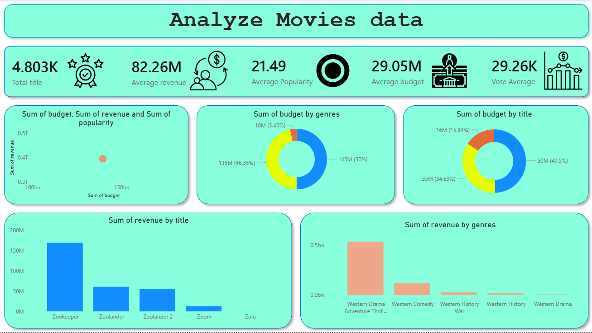

# Movie Performance Analysis

## Description

This project combines SQL, Python, and Power BI to analyze movie industry data and identify key factors that influence movie success. The analysis focuses on revenue, budget, popularity, ratings, genres, production companies, and release trends.

The objective is to transform raw movie data into actionable business insights that can help studios, producers, and stakeholders make data-driven decisions.

---

## Project Objectives

* Analyze movie revenue and profitability
* Identify top-performing genres
* Evaluate the impact of budget on revenue
* Discover trends in movie ratings and popularity
* Analyze yearly movie performance
* Create an interactive Power BI dashboard

---

## Dataset Information

Dataset: Movie Industry Dataset

Features Include:

* Movie Title
* Budget
* Revenue
* Profit
* Popularity
* Vote Average
* Vote Count
* Genre
* Release Date
* Production Company
* Runtime

---

## Project Structure

```text
Movie_performance_analysis_sql_python_powerbi/
│
├── Movies Data.csv
│
├── MySql.sql
│
├── Python/
│   └── Data Clening.py
│   └── EDA.py
│   └── Insert.py
│
├── Visulisation/
│   └── Dashboard.pbix
│   └── Image.png
│
├── READNE.md
│
└── Report.docx
```

---

## Tools & Technologies

### Data Analysis

* Python
* Pandas
* NumPy

### Data Visualization

* Matplotlib
* Seaborn
* Power BI

### Database

* MySQL

---

## Data Cleaning

The dataset was cleaned using Python before analysis.

Cleaning steps included:

* Handling missing values
* Removing duplicates
* Data type conversion
* Feature engineering
* Outlier identification
* Revenue and profit calculations

---

## SQL Analysis

Business questions answered using SQL:

* Which movies generated the highest revenue?
* Which genres perform best?
* Which production companies create the most successful movies?
* What is the relationship between budget and revenue?
* Which years had the highest movie earnings?
* Which movies delivered the highest profit?

---

## Python EDA

Exploratory Data Analysis was performed using Python to identify:

* Revenue distribution
* Budget distribution
* Popularity trends
* Rating patterns
* Genre performance
* Profitability analysis
* Correlation between key variables

---

## Power BI Dashboard

Dashboard includes:

* Revenue Overview
* Budget vs Revenue Analysis
* Top Movies
* Genre Performance
* Release Year Trends
* Profitability Analysis
* Interactive Filters and Slicers

---

## Key Insights

* High-budget movies generally generate higher revenue but not always higher profit.
* Certain genres consistently outperform others in revenue generation.
* Popularity strongly influences box office success.
* A small number of blockbuster movies contribute significantly to total revenue.
* Movie performance varies across release years and market trends.

---

## Business Recommendations

* Focus investment on consistently profitable genres.
* Optimize budget allocation based on historical performance.
* Use popularity metrics for marketing strategy planning.
* Analyze successful production companies for best practices.
* Improve forecasting using historical movie performance data.

---

## Results

The project successfully identified major drivers of movie performance and profitability through SQL analysis, Python-based EDA, and Power BI dashboarding.

The findings provide valuable insights for decision-making in movie production, investment, and marketing.

---

## Future Improvements

* Build a Movie Revenue Prediction Model
* Perform Sentiment Analysis on Reviews
* Deploy Interactive Dashboard Online
* Add Machine Learning Forecasting
* Integrate Real-Time Movie Data APIs

---

## Dashboard Preview



---

## Author

**Vivek Mali**

Aspiring Data Analyst

Skills:

* SQL
* Python
* Power BI
* Data Visualization
* Exploratory Data Analysis
